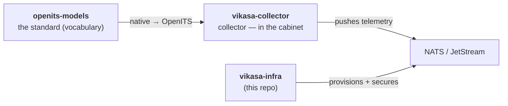

# vikasa-infra

Deploys and secures the **NATS/JetStream infrastructure** for Vikasa — the
clusters, streams, and accounts, plus the security around them: mTLS, NATS
JWT/nkey identity, cert-manager PKI, secrets, and each cabinet's NATS leaf +
scoped credentials (GitOps overlays + runbooks). **That's its whole scope** — it
does not deploy the collector or deal with the models.

Part of a three-repo split. **This repo provisions and secures the NATS/JetStream
platform the telemetry flows through — it does not deploy the collector, and has
nothing to do with the models vocabulary.**

- **`openits-models`** — the standard ("openconfig for ITS"): YANG-sourced,
  vendor-neutral telemetry + control vocabulary. *Not a `vikasa-infra` concern.*
- **`vikasa-collector`** — reference collector: the cabinet poller translates
  native SNMP/NTCIP into the OpenITS vocabulary and **pushes telemetry into
  JetStream** (plus central-side components). *Not deployed by this repo.*
- **`vikasa-infra`** — this repo: provisions and secures the NATS/JetStream
  clusters, PKI, secrets, GitOps overlays, and the cabinet (Pi) base install.



Start here:

- [`docs/README.md`](docs/README.md) — the **documentation index** (map of every doc).
- [`docs/CONCEPTS.md`](docs/CONCEPTS.md) — **the five-minute, diagram-led
  overview** (start here if you want the executive/stakeholder picture).
- [`docs/ARCHITECTURE.md`](docs/ARCHITECTURE.md) — the north-star design and the
  A–E sub-project decomposition.
- [`docs/scaling-profiles.md`](docs/scaling-profiles.md) · [`docs/capacity-model.md`](docs/capacity-model.md)
  — how to **size** a deployment (profiles, partitions, nodes, retention).

## Development

```sh
make test          # unit tests (includes golden-tree byte comparisons)
make integration   # embedded-NATS end-to-end tests (DMZ data path)
make lint          # go vet + gofmt check
make golden        # regenerate goldens after an intentional output change
```

Golden tests byte-compare `cmd/gen`'s full output tree against
`cmd/gen/testdata/golden-*`. When you change generated output on purpose, run
`make golden` (sets `UPDATE_GOLDEN=1`) and **review the git diff** — the diff
is the review artifact.

## License

Apache License 2.0 — see [LICENSE](LICENSE).

## Security

See [SECURITY.md](SECURITY.md) for how to report vulnerabilities privately.
