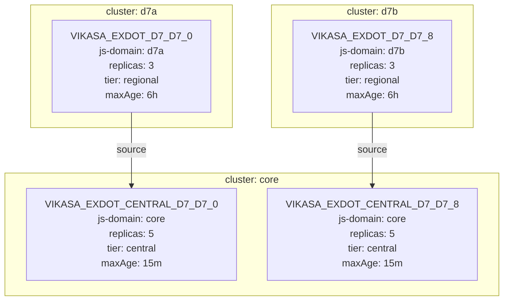

# Topology Diagram: exdot

> **Generated** by vikasa-infra/cmd/gen — regenerated on every run; do not edit.

```mermaid
flowchart TD
  subgraph cl_core["cluster: core"]
    s_VIKASA_EXDOT_CENTRAL_D7_D7_0["VIKASA_EXDOT_CENTRAL_D7_D7_0<br/>js-domain: core<br/>replicas: 5<br/>tier: central<br/>maxAge: 15m"]
    s_VIKASA_EXDOT_CENTRAL_D7_D7_8["VIKASA_EXDOT_CENTRAL_D7_D7_8<br/>js-domain: core<br/>replicas: 5<br/>tier: central<br/>maxAge: 15m"]
  end
  subgraph cl_d7a["cluster: d7a"]
    s_VIKASA_EXDOT_D7_D7_0["VIKASA_EXDOT_D7_D7_0<br/>js-domain: d7a<br/>replicas: 3<br/>tier: regional<br/>maxAge: 6h"]
  end
  subgraph cl_d7b["cluster: d7b"]
    s_VIKASA_EXDOT_D7_D7_8["VIKASA_EXDOT_D7_D7_8<br/>js-domain: d7b<br/>replicas: 3<br/>tier: regional<br/>maxAge: 6h"]
  end
  s_VIKASA_EXDOT_D7_D7_0 -->|source| s_VIKASA_EXDOT_CENTRAL_D7_D7_0
  s_VIKASA_EXDOT_D7_D7_8 -->|source| s_VIKASA_EXDOT_CENTRAL_D7_D7_8
```
