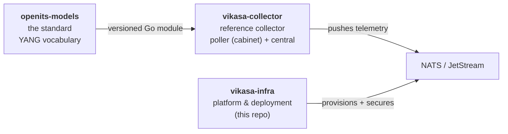
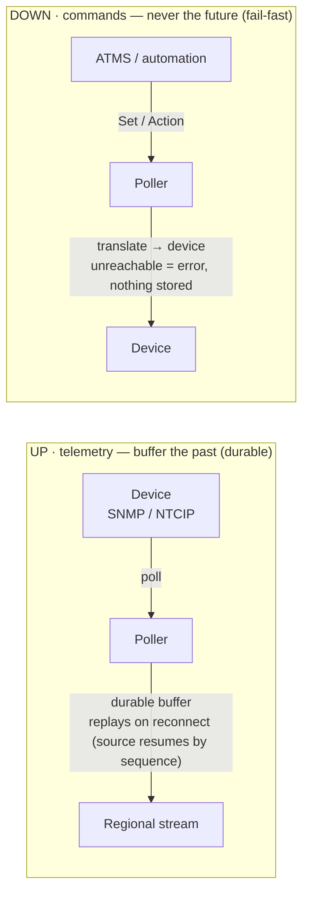
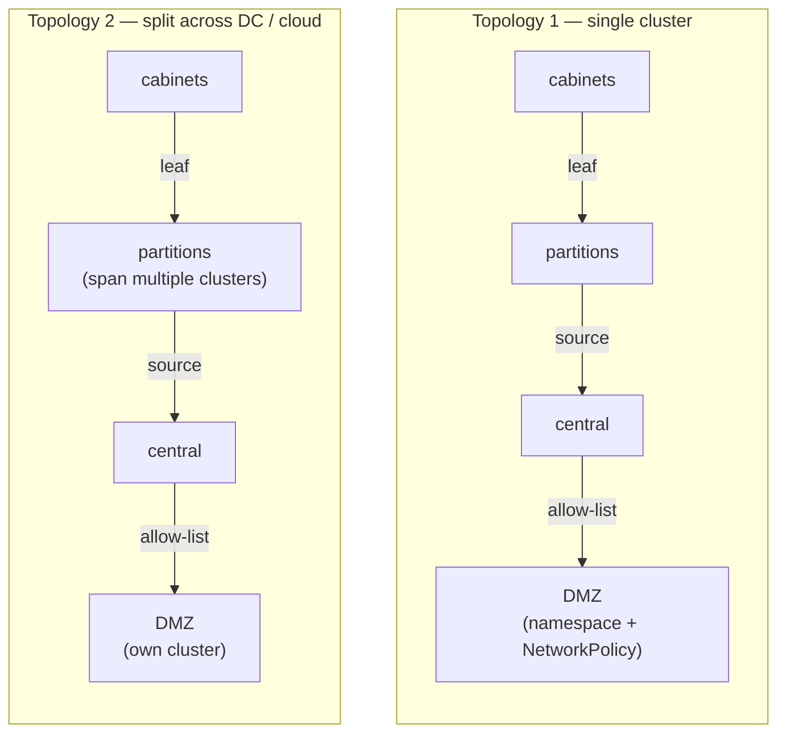
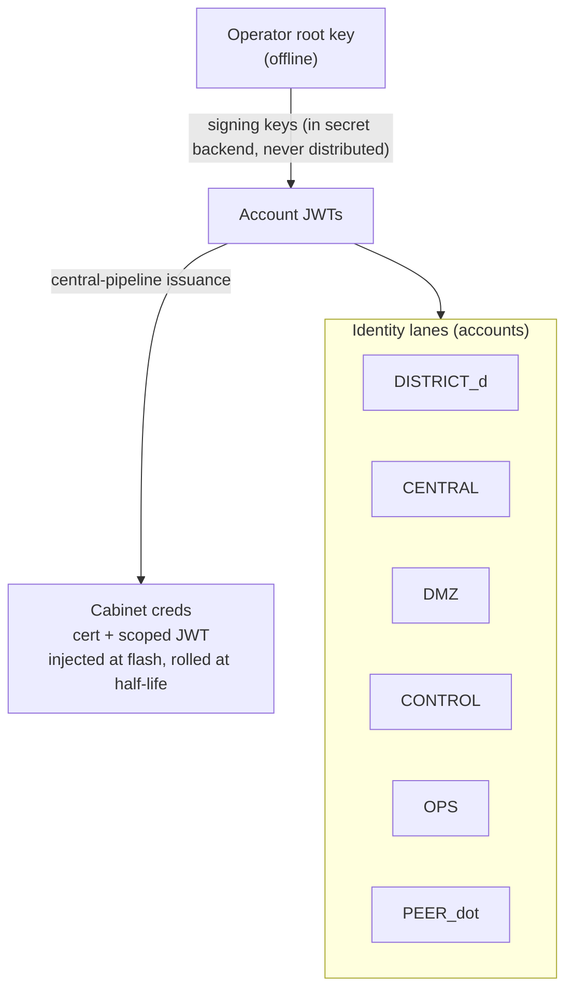
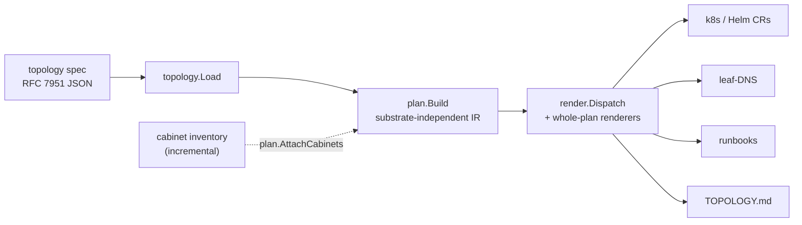

# Vikasa Production Architecture (north star)

Status: **draft / design** — updated 2026-07-01
Scope: how Vikasa goes from a single-repo lab demo to a production-deployable
system, and how the work decomposes across repos.

This document is the umbrella. It records the load-bearing decisions and the
sub-project breakdown. Each sub-project (A–E below) gets its own detailed
spec + implementation plan; this doc is what they hang off.

---

## 1. Problem statement & scope

Today Vikasa lives in one repo (the lab demo). The **data plane is
production-quality** — poller, central, the leaf/JetStream topology, cabinet
buffering, config loading, and a hardened Raspberry-Pi field install all work.
The **control plane (accounts, certs, secrets, isolation) is documentation +
scaffolding**, and that is the gap to production.

**Deployment unit = one DOT.** `vikasa-infra` deploys a single DOT consisting of:

- **N districts** (a "district" and a "region" are the same stable org unit here),
- **a central** (the DOT's aggregation + analytics tier),
- **a DMZ** (the external-sharing boundary).

Cross-DOT data sharing happens **through the DMZ** (DOT-to-DOT peering), not by
deploying a multi-DOT federation. The lab's 3-DOT federation was a demo
construct; production is per-DOT.

**We overlay onto existing clusters.** Clusters are assumed to already exist
(managed k8s in a cloud, or on-prem). `vikasa-infra` is a **pure GitOps
overlay** — it does not provision clusters. Cabinets are Raspberry Pi (ARM64) or
other systemd Linux, outside k8s.

**Two deployment topologies, one design** (see §6; distinct from the *data
profiles* of §6/`scaling-profiles.md`): everything must run as either a
**single cluster** or **clusters split across datacenters/clouds**, differing
only in connectivity/overlay — never in architecture.

So "make it production deployable" is mostly: **build the control plane** (root
of trust → accounts → per-tier credentials → cert lifecycle → secrets) and
**wrap it in repeatable, generated provisioning + runbooks** — plus the
**fleet-lifecycle** story for thousands of cabinets.

---

## 2. Repository topology

Three repos, split along genuinely different lifecycles:

| Repo | Role | Lifecycle |
|---|---|---|
| **`openits-models`** | The standard — "openconfig for ITS". The normalized, vendor-neutral vocabulary. | Published artifact, semver, others implement against it |
| **`vikasa-collector`** | Reference implementation / collector (poller, central, stream-init, keygen, SDK). | App code; produces image releases |
| **`vikasa-infra`** | Platform + deployment (this repo). Overlays, NATS accounts/PKI/secrets, Pi install, runbooks. | Ops cadence; per-environment; holds secrets refs |

`vikasa` is the org/project umbrella — no single component owns the bare name
(the openconfig precedent). Go module paths are `github.com/Vikasa2M/<repo>`.



### Why this split

- **App ↔ infra** is the highest-value cut: different cadence, access model, and
  secrets boundary; a prod config change no longer needs an app-code PR.
- **Standard ↔ implementation** because the vocabulary is a *published contract*
  vendors and other agencies build against (the openconfig/public precedent).

### Dependency mechanism

`openits-models` publishes a **versioned Go module** (generated Go bindings
committed at each tag), consumed as a normal semver bump:

```
// vikasa-collector/go.mod
require github.com/openits/openits-models v1.4.0
```

The standard owns generation; the collector imports the result.

---

## 3. The standard (`openits-models`)

`openits-models` is **not a southbound device contract** — vendors do not emit
it natively. The collector *translates* native SNMP / NTCIP / HR-logs **into**
it. So the standard is a **normalization vocabulary**, and it is
**bidirectional**: telemetry (native → `openits-models`, up) and control
(`openits-models` → native, down). A normalized command vocabulary ("set pattern 3" regardless of
Econolite vs McCain) is as valuable as normalized telemetry — the openconfig
value proposition.

### Always YANG-sourced, never hand-authored

YANG is the single source of truth; everything else is generated and published:
proto wire contracts, JSON-Schema registry (browsable site), AsyncAPI, and the Go
bindings module. Generation + lint gates (`yang-lint`, buf `WIRE_JSON`) live
here. The hand-authored `command.proto` / `device.proto` are **retired** in favor
of YANG-modeled control.

### Lessons taken from openconfig

| Lesson | Application |
|---|---|
| **config/state ("opstate") split** | Model the device tree once: writable `config` (intended) + read-only `state` (applied/derived). Control = Set on `config`; telemetry = Subscribe on `state`. |
| **Declarative intent > imperative RPC** | Steady-state intent (pattern, plan, mode, schedule) = `config` nodes. Reserve `action`s for momentary acts. |
| **`identityref`, not `enum`** | Flash-type, device-type, fault-type, command verbs as YANG `identity` so vendors extend without forking the core. |
| **Vendor-neutral core + deviations/augments** | Core neutral; vendor specifics via `augment`; "this controller can't force-off" via `deviation`. |
| **Per-module semver + hard compat policy** | Version per module; additive = minor, breaking = major; enforced in CI. |
| **Transport-agnostic models** | No NATS in the YANG/proto. Subjects/transport live in the collector. |
| **gNMI / gNOI / gNSI separation** | Two command families: traffic-domain control vs operational/infra (reboot, cert-rotate, firmware — the gNOI analog), different authz. |
| **Conformance + governance is half the product** | Ship validation fixtures + a self-certify path + changelog/contribution process. |

---

## 4. Control model — the collector is a stateless proxy

The **model** (`openits-models`) distinguishes, in YANG: `config` (device-persisted
intent), `state` (read-only applied/derived), `action`s (momentary acts), and an
operational/infra family (gNOI analog). This is the openconfig/**gNMI** model:
**the device owns its config datastore**; the management plane does
**Set / Get / Subscribe** against it.

**The collector is a stateless proxy/adapter**, not a database. It makes a legacy
SNMP/NTCIP controller *speak `openits-models`*:

- **Set** → translate to native write → device acks → ack returns upstream → **done**.
- **Get** → translate to native read → return as model. ("What is C's config?" is a
  Get to the *device*, never a lookup in a Vikasa store.)
- **Subscribe** → poll + stream telemetry.
- **Action** → ephemeral, expiring, momentary.

This is deliberately **not** the k8s/etcd "central desired-state + reconcile loop"
model. There is **no KV, no config mirror, no reconcile loop, no desired-state
store anywhere in Vikasa.** The endgame ("a proxy until devices speak the model
natively") *requires* this: a native `openits-models` device wouldn't sit behind a
collector, yet its config semantics must be identical — so config semantics live
in the model (device-owned datastore), not in the collector.

### The governing rule: **buffer the past, never the future**

- **Telemetry** = observations of what already happened → **buffered durably**
  (cabinet local JetStream) so history is never lost.
- **Commands** (config Sets, actions) = intent about what *should* happen →
  **never buffered, always fail-fast.** Unreachable target → error to the issuer;
  nothing is queued or stored.

Rationale (operator's words): *we don't want a command to sit for 6 hours then
fire when the device comes back and be wrong.* A stale command is worse than no
command.



### Out of scope for the collector (→ northbound)

Drift detection, config compliance, and auto-reprovision-on-controller-swap are
**not** collector features. They are northbound applications built on `openits-models`
Get/Set (or the agency's ATMS). We never smuggle a reconcile loop into the
collector.

### Standard vs collector boundary

- **Standard**: the *what* — `config`/`state` tree, `action` definitions, a
  modeled `command-result` notification.
- **Collector**: the *how* — Set/Get/Subscribe/Action transport, correlation/ack,
  the **southbound translators**, and the (durable, optional) **audit log** of
  issued commands (an event stream — distinct from any desired-state store, of
  which there is none).

---

## 5. The cabinet

The whole system, collapsed to one box in the field:

```
┌─ Traffic cabinet  (Pi / systemd Linux, hardened) ───────────────────┐
│  field LAN              vikasa-poller (the proxy/agent)             │
│  ┌─────────┐  SNMP/    ┌──────────────────────────────────┐         │
│  │ ASC     │◄─NTCIP───►│ • poll → translate to OpenITS (UP) │         │
│  │ RSU/DMS │◄─────────►│ • Set/Get/Action → native (DOWN)   │         │
│  └─────────┘           │ • A/B update agent (rauc + NATS)   │         │
│   (1–3 devices)        └─────────────────┬──────────────────┘         │
│                     nats-server (leaf, JS domain = cabinet-id)        │
│                     VIKASA_BUFFER (durable telemetry, ce-id dedup)    │
└──────────────────────────────────────────┼──────────────────────────┘
                                  ONE outbound mTLS leaf
                                  dials leaf.<partition>.vikasa.<dot>
```

- **One outbound mTLS leaf connection** (dials out — NAT/firewall friendly, no
  inbound ports). Telemetry, Sets, Gets, actions, and fleet updates all multiplex
  over it.
- **Up = telemetry, by pull.** Poll → translate → write local `VIKASA_BUFFER`.
  The cabinet is then passive; its partition's regional stream **sources** the
  buffer. Survives cuts (buffer accumulates; on reconnect the region's source
  resumes from its last sequence — no gap, no re-source). End-to-end de-dup is
  `ce-id`-keyed at the sinks, not stream-level (stream dedup is off on sourcing
  streams — see §6).
- **Down = commands, fail-fast proxy.** Subscribes its `.cmd.>` / Set/Get; the
  only active-delivery code is the action/command handler (authz + expiry →
  translate → device → ack). Nothing stored.
- **Dumb about topology** — it knows only its dialed DNS name; it knows nothing of
  partitions, other cabinets, central, DMZ, or sourcing. All of that is
  region-side.
- **Identity ≠ placement** (see §6): stable identity in the subject; the cluster
  it dials is just a DNS name.

---

## 6. Topology & scaling

### Leaf links all the way up → one design, two deployment topologies

Every inter-tier link is a **NATS leafnode** (outbound-initiated, TLS,
NAT-friendly): cabinet → district, district → central, central → DMZ. A leafnode
behaves identically whether the remote is an in-cluster Service or a WAN DNS
name, so **single-cluster vs multi-cluster is purely an endpoint/exposure overlay**
— accounts, subjects, and streams are byte-identical. **mTLS on every leaf link in
both profiles** (no soft interior).



> Same accounts, subjects, and streams in both profiles — only the
> endpoint/exposure overlay differs.

### Identity ≠ placement (the core rule)

- **Identity** = `district / agency / cabinet-id` → the subject prefix
  `vikasa.<dot>.<district>.>` (the only fixed anchor is `vikasa.<dot>.`;
  everything below it is the DOT's, and a district may declare its own prefix).
  Stable.
- **Placement** = which cluster a cabinet leafs into = a **stable per-partition
  DNS name** the cabinet dials. Mutable, infra-side.
- Central and DMZ subscribe **by district token, never by cluster** — so
  rehosting/rebalancing is transparent downstream.

### Partition = the scaling/placement atom

A **district is a stable logical identity made of N partitions.** A **partition**
is a stream (one RAFT group, hosted on exactly one cluster). A **cluster** hosts
one or more partitions. A district can therefore span **multiple independent
clusters** (no supercluster) — central just sources each cluster's partition
streams cross-domain (`$JS.<domain>.API`), which it already does. Example: a
6,000-cabinet metro district served by **3× 3-node clusters**, all under
`vikasa.<dot>.7.>`, gives fault isolation + independent upgrades + distributes the
cabinet-source fan-in across 9 nodes.

### Pull keeps the edge dumb

Cabinet→region uses **native JetStream sourcing** (region pulls each cabinet's
buffer). This keeps cabinets dumb and centralizes all fleet/data management to
~per-district configs: onboarding, partitioning, retention are **regional (spec)
config**, zero cabinet touches. Cost is region-side source fan-in (~2,140/district
at the example scale), mitigated by partitioning (K streams) so no single leader
holds all sources. A cabinet-side **forwarder push** is documented as a
break-glass fallback if cross-domain source recovery proves untenable at raw-HR —
but it is *not* the default (it would push logic to 15k edge nodes).

### Scale levers (in order; reserve identity-splits for org changes only)

1. **Vertical** (bigger NVMe nodes) — first. (Replication is capped at **R≤5** per
   stream, but a *cluster* can be far larger than R; you scale by adding **shards**
   — leaders spread across nodes — not replicas.)
2. **Partition within the cluster** (K streams on the same nodes).
3. **Partition across an added cluster** (district spans clusters).
4. **Split the district identity** — *only* for organizational reorgs, never for
   capacity.

**Shard, don't split.** Use **explicit partition assignment** (in the spec/
inventory, by geography), not hashing — growth moves a *chosen* subset, never a
hash-avalanche.

**Central shards the same way.** Central is **not** one stream — it is one
aggregation shard **per partition** (`VIKASA_<DOT>_CENTRAL_<D>_<P>`, R3), each
sourcing its regional partition, so no single leader holds the whole DOT and a
large district arrives pre-split. Central runs **short retention (minutes)** — it
is aggregation/routing, not the archive. Every stream is **bounded** (`max_bytes` +
`max_age`); **stream-level `ce-id` dedup is off on sourcing streams**, so
deduplication lives at the idempotent sink (ClickHouse) internally and at the DMZ
stream's dedup window externally. (Findings C1/C2/C4,
`docs/decisions/2026-07-11-jetstream-scaling-review.md`.)

### Capacity & the ingest envelope

Sizing is governed by a **sensor-grounded capacity model** — `docs/capacity-model.md`
(derivation) and `docs/scaling-profiles.md` (operator sizing per profile), which
replace the old bare "~20–100k msg/s" figure. Key results:

- The **perception vendor already reduces at the edge** (raw points never touch
  NATS); the cabinet rate is set by *which output Vikasa ingests* — **events**
  (~tens/s) vs **full object tracks** (~hundreds–thousands/s) — a scope decision,
  not a fixed multiplier.
- If ingesting tracks, the wire envelope must be **per-frame object arrays** (not
  per-object): the same 45 partitions serve ~17,000 fusion cabinets batched vs ~850
  per-object. **The envelope, not the partition count, is the dominant lever.**
- Two **data profiles** (a separate axis from the deployment topologies above) —
  **Normal** (message-bound) and **Full-Track / Digital-Twin**
  (bandwidth-bound), plus mixed — sized in `scaling-profiles.md`. A single all-JetStream
  DOT tops out near the **largest real deployment (~15–30k cabinets)**; national scale
  is **federation via the DMZ**, not one cluster.
- Per-leader/per-node throughput anchors (~75k msg/s, ~100 MB/s R3) still come from a
  **load test** — the capacity model is the thing to test *against*.

### Generated from one source of truth

The **placement mapping** (cabinet → partition → cluster) is the most load-bearing
generated state: it drives telemetry source lists, central's aggregation, and
per-partition leaf DNS — **both directions from one mapping.** It deserves real
rigor (validation, no-orphan checks, atomic regeneration).

### Rebalance runbook (district 7 grows 1 cluster → 2)

Online, idempotent, only the moved subset affected, identity unchanged:

1. Stand up the target partition stream on cluster 7b (empty), generated from the
   placement change (P → 7b).
2. Add 7b's P-stream to the central shard's source list (dual-source briefly). The
   overlap yields duplicate deliveries; these are absorbed **downstream by
   idempotent sinks keyed on `ce-id`** (ClickHouse), and at the sharing boundary by
   the DMZ stream's dedup window — **not** by stream-level dedup, which is off on
   sourcing streams (see the §6 dedup note / `docs/decisions/2026-07-11-jetstream-scaling-review.md` C4).
3. Repoint `leaf.7-pN` DNS → 7b; cycle those cabinets' connections at 7a so they
   reconnect and re-resolve.
4. Cabinets land on 7b: telemetry re-sourced from current sequence (durable buffer
   → no gap; any duplicate delivery reconciled by `ce-id`-keyed sinks).
5. Confirm via status, then tear down P on 7a (remove source, delete stream).

Cabinet config is **never touched** — DNS is the indirection.

---

## 7. DMZ & cross-DOT federation

The DMZ is its own trust zone in **all** profiles (own namespace + strict
NetworkPolicy + node pool in single-cluster; own cluster in multi-cluster). It is
**bidirectional**:

- **Egress**: central → DMZ, **one-way push**, filtered by a **declarative subject
  allow-list** (deny-by-default; validation requires every share's public `as`
  subject to live under `vikasa.<dot>.share.>` or `vikasa.peer.<dot>.>` —
  internal subject shapes are rejected). External
  consumers get per-consumer, revocable, **subscribe-only, subject-scoped** JWTs.
  Editing what's shared = editing the allow-list → regenerate → GitOps.
- **Ingress (peer DOTs)**: another DOT is just an authorized external consumer of
  our DMZ. When *we* consume a peer, their data lands in a **quarantined
  peer-ingest account**, namespaced under their identity (`vikasa.peer.<dot>.>`),
  **read-only** — never injected into our internal bus.

**Egress mechanism (validated end-to-end).** The DMZ hosts an egress stream that
**sources the central shard set cross-domain** (`$JS.<central-domain>.API`) and
**remaps** the internal district space `vikasa.<dot>.<district>.>` onto a public
share space `vikasa.<dot>.share.<name>.>` via a per-source **subject transform**.
Because central is sharded per partition (§6), each share **fans across every
central shard of its district** (one source per shard, same transform) — and an
overlapping corridor (one that feeds both, say, a `research` and a `peer` share)
fans across the shards for each share it qualifies for. Internal subjects never
appear in the DMZ stream. The share catalog (public subject ↔ consumer) renders to
the generated `dmz-catalog.md` and is **unchanged by sharding** (the external
contract is subject-based, not stream-based).

**Consumption is tiered** (Decision D3): the DMZ stream **`RePublish`es** committed
share/peer messages onto the core-NATS bus, so the **default** third-party path is a
plain **core-NATS subscription** — ephemeral, partition-agnostic, scales to many
consumers, keeps strangers off the JetStream API. **Durable JetStream consumers** are
reserved for the few named peers who need replay/gap-fill. Per-consumer JWTs are
subscribe-only, scoped to a share subject (the same ACL covers both paths). The DMZ
stream carries an explicit **dedup window** — the one controlled hop where NATS-side
dedup protects peers who can't dedup themselves.

**Bilateral DMZ-to-DMZ peering now; a neutral corridor hub is the same mechanism
later** (the hub as a participant) — noted as a future option, not built now.

Optional Layer-2 **field redaction** (a bridge that scrubs fields, not just
filters subjects) is designed-for but YAGNI'd until a real redaction need lands.

---

## 8. Control plane / security (sub-project B)

The gap to production, now designed. **Two auth mechanisms, separated:** mTLS
(cert-manager) = transport encryption + mutual transport auth; **NKEY/JWT
accounts** = identity + authorization, the system of record.

### Trust & issuance

- Operator root key kept **offline**; signs accounts via signing keys.
- **Central-pipeline issuance (tight key custody):** the generator + External
  Secrets mints all cabinet creds; signing keys live only in the secret backend,
  **never distributed**. Delegated per-district signing is an opt-in for genuinely
  autonomous districts, not the default.
- Account JWTs distributed via the **NATS-native account resolver**.



### Account topology (system-identity lanes, not user roles)

| Account | Holds | Cross-account flow |
|---|---|---|
| **`DISTRICT_<d>`** | district's cabinet users + its regional partition streams (cabinet→region sourcing intra-account) | exports telemetry → CENTRAL |
| **`CENTRAL`** | aggregation streams + analytics sinks | imports districts; exports filtered subset → DMZ |
| **`DMZ`** | external-consumer users (subscribe-only, scoped) | imports CENTRAL's allow-list (one-way) |
| **`CONTROL`** | traffic-command *system* lane (ATMS/automation connections) | exports command service → DISTRICTs |
| **`OPS`** | operational/infra *system* lane (reboot/cert/firmware) | separate authz + audit from CONTROL |
| **`PEER_<dot>`** | quarantined inbound peer-DOT data, read-only | imports a peer's DMZ |
| **`SYSTEM`** | `$SYS`, monitoring | — |

Cabinet users get **publish own-prefix + subscribe own `.config.>`/`.cmd.>` from
day one** (publish-only creds would force re-issuance when control turns on).

> **Decided refinement (pending implementation — findings C3/D6).** The table above
> is the *current* model. Cross-account JetStream *sourcing* (as opposed to a plain
> stream import) requires the origin account to export its `$JS.<domain>.API` service
> + a deliver prefix + `$JS.FC`, which the generated model does not yet emit — so the
> multi-account sourcing path is unproven (the integration test currently runs a
> single account spanning domains). The decision: **collapse `DISTRICT_<d>` + `CENTRAL`
> into one internal account** (making the hot regional→central sourcing *intra*-account),
> and keep **`DMZ`/`PEER` isolated** with generated `$JS.API`+deliver+FC service
> import/export pairs — isolation exactly at the external trust boundary. Tracked as
> the account-model plan; see `docs/decisions/2026-07-11-jetstream-scaling-review.md`.

### Cabinet identity lifecycle

- **Initial** = injected at **flash/install** (the trusted physical moment) —
  central mints the scoped JWT + cert, imaging writes them. No bootstrap-token
  exchange needed.
- **Rotation** = a **rolling chain**: each renewal is authenticated by the
  *current valid cred*, over NATS, served by the central identity service. ~30–90d
  certs, auto-renew at half-life. The **keypair stays put; only the signed
  assertions (cert/JWT) roll** — keypair rotation reserved for compromise.
- **Recovery**: a cabinet dark *longer* than its cred lifetime ages out → re-flash
  (same physical channel). Lifetime tuned > normal max-offline so this is rare.
- **Revocation**: NATS JWT revocation (immediate) + short cert (backstop) +
  inventory removal (stops renewal).

### Credential-health monitoring (a B deliverable)

The rolling chain's one failure mode is silent non-renewal → truck roll. Detect it
with lead time:

- **Source of truth = the issuer.** Central tracks every issued cred's expiry +
  last renewal over inventory → **absence detection** (a silent cabinet can't hide;
  the missing renewal is flagged). Use **central's clock**, never the cabinet's.
- **Cabinet self-report** adds the *why* (CA error, unreachable, disk full).
- **Tiered alerts slip→cliff:** warn when renewal first slips (~day 50), escalate
  to a hard page near expiry (~5d). Surface on `fleet-health.json` beside the
  liveness/heartbeat monitoring; rules in `deploy/grafana/alerting/vikasa.yaml`.
- Auto-retry with backoff handles transient slips; alerts are for persistent fail.

### Downward-control authority — Vikasa is transport, the ATMS is authority

All **policy** lives at the **ATMS**: user identity, fine-grained per-intersection
authz, approval workflows, command priority/arbitration, severity, decision-audit.
Vikasa owns only the irreducible transport floor (a bus to physical signals cannot
be an open door, or the ATMS's authority is bypassable):

- **Authenticate the connected system** (mTLS + JWT).
- **Confine it to its lane** — coarse per-system subject ACL (which district +
  command-family it may publish). `CONTROL`/`OPS` accounts *are* these lanes; a TSP
  engine can only put TSP commands on the wire.
- **Fail-fast expiry** + **device-deviation gating** at the cabinet (reject what a
  controller physically can't do); the broker already rejected out-of-lane publishes.
- **Wire-level audit** (defense in depth, independent of the ATMS): dual-sided —
  central logs issued (incl. rejected attempts = security events), cabinet logs
  applied/failed; reconcile issued-vs-applied → ClickHouse. Event log, not a store.

### Secrets & cleanup

- **External Secrets Operator** over a secret backend for signing keys, CA
  material, ClickHouse/Infrahub creds.
- **Retire any statically-provisioned Infrahub tokens** in favor of the
  External Secrets path (the generated output already uses `externalsecret.yaml`).

---

## 9. Toolchain (settled)

| Layer | Choice | Notes |
|---|---|---|
| Substrate (IaC) | **none required** — pure overlay on existing clusters | optional thin IaC only for greenfield DNS/LB/IAM |
| GitOps engine | **Argo CD** | per-cluster pull (default, multi-cluster) or hub (co-administered); see §13 |
| Templating | Kustomize overlays + Helm (NATS) + **our generator** | generator renders NATS accounts/streams/placement/certs from the spec |
| Secrets | **External Secrets Operator** | + a secret backend |
| PKI / mTLS | **cert-manager** | per-DOT CA issuer |
| NATS streams/accounts | **NACK** CRDs + our generator (extends `keygen`) | declarative streams + generated accounts |
| Policy guardrails | **Kyverno** (optional, recommended) | enforce netpol/no-privileged/deny-by-default sharing |
| Supply chain | **cosign + Trivy** (recommended) | sign + scan images/artifacts |
| Observability | Prometheus + Grafana (+ Loki, OTel collector) | OTel hooks already exist |
| Service mesh | **none** | NATS does its own mTLS; a mesh is redundant |
| Cabinet bootstrap | **Ansible** (or golden image) | one-time only |
| Cabinet updates | **pull-over-NATS + A/B** (sub-project E) | *not* Ansible push |

---

## 10. Cabinet fleet lifecycle (sub-project E)

Push/SSH (Ansible) does not scale to ~15k intermittently-connected, NAT'd edge
nodes. The model is **pull-based + atomic image A/B**, reusing the bus every
cabinet already holds:

- **Mechanism (don't build): `rauc` / `ostree` + greenboot** — A/B rootfs, atomic
  swap, **auto-rollback** on failed health checks. Bricking 15k Pis is not
  recoverable in the field, so this layer must be proven.
- **Orchestration (we build): over NATS** — desired version + rollout policy
  published per cohort (`vikasa.fleet.<cohort>.desired`); cabinets report
  `current version + slot + health` (`vikasa.fleet.status.>`) → real-time fleet
  inventory. Staged rollout by subject targeting (canary → district → fleet),
  health-gated promotion, auto-halt circuit breaker.
- **Artifact transport**: JetStream Object Store vs OCI+regional mirror — decide
  on bandwidth math (15k × hundreds-of-MB needs deltas + staging either way).
- **ITS-specific safety**: **traffic-aware maintenance windows** — a signal
  cabinet must not reboot during rush hour. Off-the-shelf tools don't know this;
  it's an argument for NATS-side orchestration.
- **Security**: cosign-signed artifacts verified on-device; only the fleet-control
  account may publish `desired`.

Recommendation: **hybrid — rauc/ostree for the A/B mechanism, NATS for
orchestration/status/policy.** Constrains the cabinet OS to an A/B-capable image
(decide early).

---

## 11. Decomposition & sequencing

Each is its own spec → plan → build.

| # | Sub-project | Scope | Depends on |
|---|---|---|---|
| **A** | **Repo restructure + release pipeline** | Extract `openits-models` (Go module + registry site); slim `vikasa-collector`; scaffold `vikasa-infra`; semver + CI gates. | — |
| **B** | **Control plane / security** | NATS operator + accounts/ACLs (pub+sub cabinet creds), cert-manager mTLS + cabinet enrollment, External Secrets, kill hardcoded token. | A |
| **C** | **Production deployment topology** | Argo overlays for the two deployment topologies; district/partition placement generator; per-partition leaf DNS; HA, retention, rebalance + scaling runbooks; observability. | A, B |
| **D** | **YANG control model** | config/state tree + actions + `identityref` refactor + deviations; generation updates; collector Set/Get/Subscribe proxy + southbound translators (no reconcile/store). | A |
| **E** | **Cabinet fleet lifecycle** | A/B image (rauc/ostree) + NATS-orchestrated pull updates; traffic-aware windows; signed artifacts; fleet status. | A, (B for auth) |

**B + C are the "production deployable" goal.** A is prerequisite scaffolding.
D makes control real; E is the hardest operational problem (15k cabinets).

Recommended order: **A → (B, D in parallel) → C → E** (E can start design earlier).

---

## 12. Open decisions (resolve in sub-project specs)

- **Secret backend** (B): which backend behind External Secrets.
- **Artifact transport** (E): JetStream Object Store vs OCI + regional mirror.
- **Cabinet OS image** (E): which A/B-capable base for Pi (rauc-on-Debian vs
  ostree/Fedora-IoT vs Flatcar-arm).
- **Repo hosting / org** (A): GitHub org, module path (`github.com/Vikasa2M/...`).
- **Load-test targets** (C): the per-leader/per-node throughput anchors (~75k msg/s,
  ~100 MB/s R3) and source-recovery thresholds that set partition count K and node
  sizing — the capacity model (`docs/capacity-model.md`) is the thing to measure against.

### Settled (no longer open)

**Toolchain:** GitOps = Argo CD · Secrets = External Secrets Operator · PKI =
cert-manager · IaC = none (overlay on existing clusters) · service mesh = none.
**Data/control:** config = stateless proxy, device-owned datastore, fail-fast, no
store/reconcile · buffer-the-past-never-the-future · DMZ peering bilateral now
(hub later) · R3 region unit, scale by partition + multi-cluster-per-district ·
identity ≠ placement.
**Scaling (JetStream review — `docs/decisions/2026-07-11-jetstream-scaling-review.md`):**
central **sharded per partition** (R3, short retention) · every stream **bounded**
(`max_bytes`+`max_age`) · **dedup at idempotent sinks** (ClickHouse `ce-id`) + a DMZ
dedup window (stream-level dedup off on sourcing streams) · DMZ consumption **tiered**
(core-NATS `RePublish` fan-out default, durable JS consumers for named peers) ·
**per-frame perception envelope**, events-vs-tracks a scope decision · two data
profiles (Normal / Full-Track-Twin) · pure-NATS-central is a **documented escape hatch**, not
built · account model = **internal-shared, DMZ/PEER isolated** (C3/D6, *pending impl*).
**Security (B):** central-pipeline issuance + tight key custody (operator offline,
no distributed signing) · NATS-native account resolver · flash-time initial
identity + rolling-chain rotation (~30–90d certs, assertions roll / keypair stays) ·
credential-health monitoring (issuer-side absence detection) · Vikasa = transport
(authenticate system, confine to lane, fail-fast, wire-audit), ATMS = all policy.
**Generator/deploy (§13):** declarative rerunnable renderer + separate advisor ·
logical-skeleton-first / cabinets onboarded incrementally · substrate-per-cluster
PLAN→renderers · per-cluster slices, per-cluster-Argo default · humble generator +
runbook for the un-automatable · size near-term & grow on-demand via rerun.

---

## 13. The generator, substrates & operating model (A3)

`vikasa-infra`'s center is a **declarative, rerunnable renderer** (like
`terraform apply` / Argo) — *not* a wizard, *not* an autoscaler. Three layers:
**logical-topology model → substrate-independent PLAN → pluggable renderers.**
The model is a **hand-written Go model** (`internal/topology`) over the
YANG-encoded **RFC 7951 JSON** spec — the schema lineage is YANG, but there is no
`ygot`/`goyang` codegen; `topology.Load` unmarshals the JSON directly.



- **Logical vs physical.** The generator renders the *logical* skeleton (clusters,
  districts, partitions, central, the partition→central sourcing, leaf-DNS),
  provisioned **central→regional**. **Cabinets are physical** and onboarded
  **incrementally** (dynamic `partition←cabinet` source-add, batched / InfraHub-fed)
  — never in the static spec. Logical is small/fast and useful with zero cabinets;
  cabinets attach without blocking it (matching a months-long rollout).
- **Substrate per cluster.** Each cluster declares a substrate: `kubernetes`
  (shared context = mode 1; per-cluster context = mode 2) or `bare-metal` (hosts).
  The PLAN is substrate-free; renderers materialize it — **k8s** (NACK `Stream` CRs
  + Argo sync-waves) vs **bare-metal** (nats.conf + stream-init + systemd). Mixed
  dispatches per cluster. The lab already has both ends (NACK + `stream-init`).
- **Humble about control.** Reconcilable artifacts *only* where we own the
  substrate; **everything we don't control → runbook instructions** — DNS by hand
  on bare-metal (external-dns optional on k8s), physical installs, cross-boundary
  steps. The generated **Markdown runbook** is the delivery channel for the
  un-automatable (→ pandoc → PDF/Word for DOT IT). It can't drift — it renders from
  the same PLAN.
- **Per-cluster slices.** Output is organized per cluster; **reconciliation is the
  operator's choice** — **per-cluster Argo (pull)** is the default for multi-cluster
  (no cross-cluster API access; fits district autonomy), **hub-Argo** when
  co-administered, kubectl/systemd otherwise. Documented in the runbook.
- **Render vs advise; preload vs grow.** Core = **render** (materialize the
  *declared* shape; never guesses scale). A follow-on **capacity advisor** takes
  expected-counts + load-test rules → *recommends* a partition/cluster layout; the
  operator reviews and commits it as the explicit spec. **Size the logical shape for
  near-term scale and grow on-demand**; cabinets zero-preload. **Expansion = rerun**
  (edit spec → rerun → delta + rebalance runbook → apply). Humans decide *when*
  (from monitoring) and edit the **spec, never the manifests**; the generator
  computes the *how*. Not by hand, not auto.

First slice (A3): the **renderer** with a hand-declared topology + k8s/DNS/runbook
renderers. Since delivered: the bare-metal renderer, cabinet onboarding
(inventory → stream sources + scoped credentials), the diff/rebalance runbook,
Helm packaging, and DMZ egress. Remaining follow-on: the capacity advisor.
