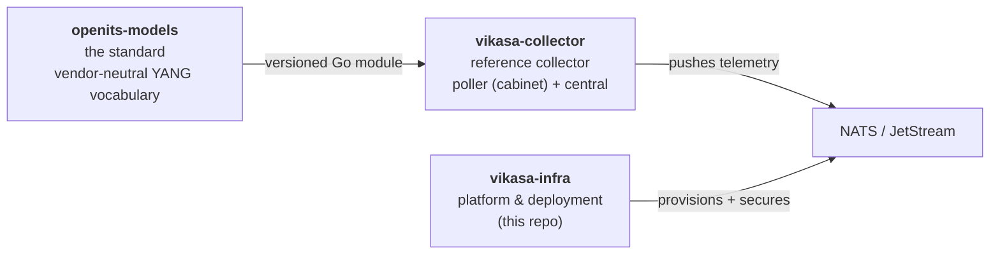
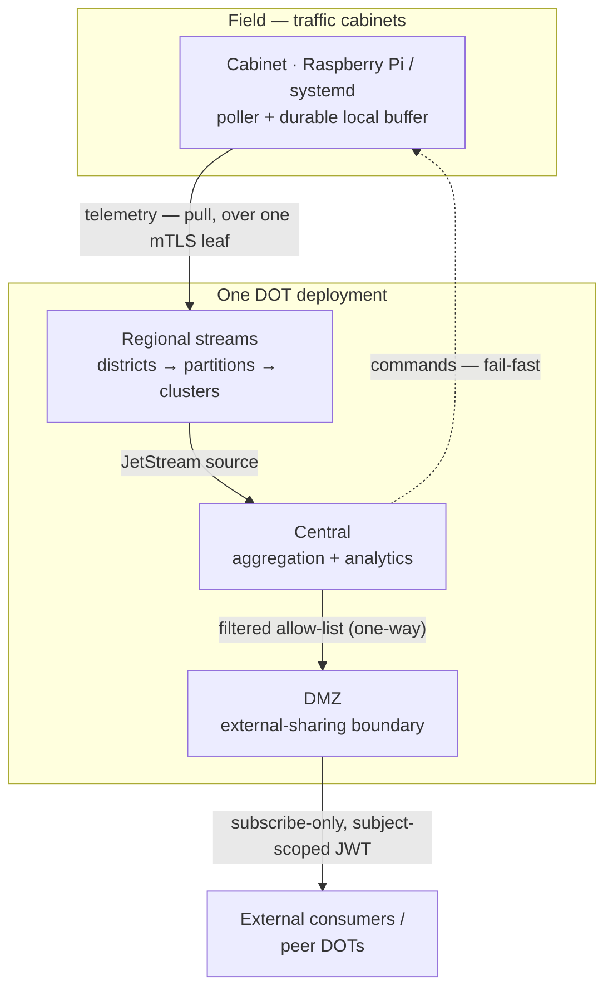
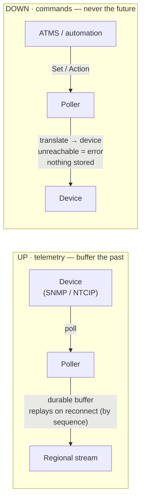
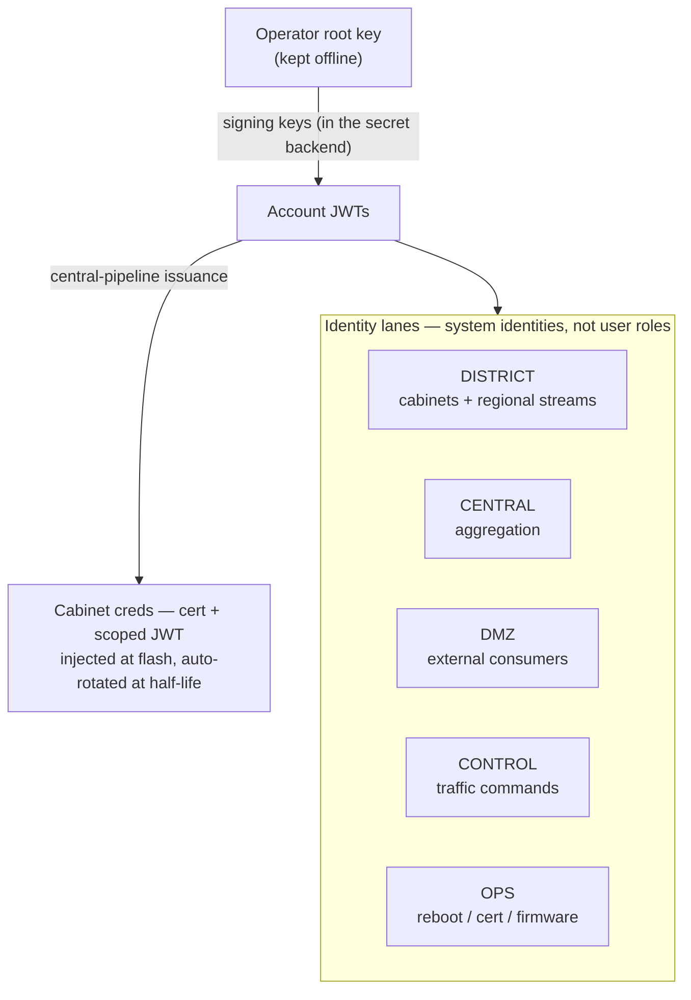
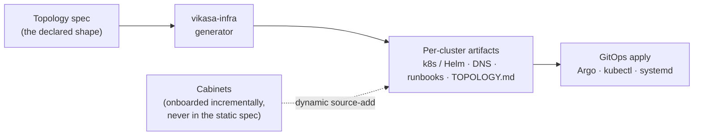

# Vikasa — Concepts at a Glance

> An executive / stakeholder overview. For the full engineering north star, see
> [`ARCHITECTURE.md`](ARCHITECTURE.md). This page is the five-minute version,
> built around diagrams. Every diagram below renders directly on GitHub.

`openits-models` is **"openconfig for traffic infrastructure"**: a vendor-neutral
vocabulary for telemetry collected from, and control sent to, traffic devices
(signals, RSUs, DMS) regardless of who made them. **Vikasa** is the platform
that deploys and secures the NATS/JetStream bus it travels over.

---

## 1. Three repositories, three lifecycles

The project is split where the lifecycles genuinely differ: a published
**standard**, an **implementation**, and the **deployment platform**.

- **The standard** is a *published contract* others build against (the
  openconfig precedent) — so it versions on its own cadence.
- **The collector** translates native SNMP / NTCIP into the standard, up and down,
  and (in the cabinet) pushes telemetry into JetStream.
- **This repo** deploys and secures the **NATS/JetStream platform** that telemetry
  flows through — not the collector, not the models.

---

## 2. The system at a glance — one DOT

The unit of deployment is **one DOT** (department of transportation): N
**districts**, a **central** aggregation tier, and a **DMZ** for external sharing.
Data flows up; commands flow down; everything outside the DOT goes through the DMZ.

- **One outbound mTLS connection per cabinet** — NAT/firewall friendly, no inbound
  ports. Telemetry, commands, and fleet updates all multiplex over it.
- **Cross-DOT sharing happens through the DMZ**, never by federating DOTs. A peer
  DOT is just an authorized, read-only external consumer.

---

## 3. The governing rule — buffer the past, never the future

This single principle shapes the whole data model. **Telemetry** (what already
happened) is buffered durably so history is never lost. **Commands** (intent about
the future) are never queued — if the target is unreachable, the issuer gets an
error immediately.

> *Rationale: a command must never sit for six hours and then fire when the device
> comes back — by then it may be wrong. A stale command is worse than no command.*

The collector is a **stateless proxy**, not a database: there is no desired-state
store and no reconcile loop anywhere in Vikasa.

---

## 4. Security — identity lanes from an offline root

Two separate mechanisms: **mTLS** for transport, and **NKEY/JWT accounts** for
identity and authorization (the system of record). Trust descends from an
**offline operator root** into purpose-built **lanes**, down to per-cabinet creds.

- **mTLS on every link, in every profile** — no soft interior.
- **Traffic control (CONTROL) and operational/infra acts (OPS) are different
  lanes** with different authorization and audit — rebooting a box is not the same
  authority as changing a signal pattern.
- **Vikasa is transport; the ATMS is the authority.** Vikasa carries commands
  and proves who sent them; it does not decide traffic policy.

---

## 5. How it gets deployed — render, don't wizard

The platform's core is a **declarative, rerunnable generator** (think
`terraform apply`, not an autoscaler). You edit one **spec**; it renders every
artifact — and the parts we can't automate become **generated runbooks** that
can't drift, because they render from the same source.

- **One design, two deployment topologies.** Everything runs as a *single cluster*
  or *clusters split across datacenters/clouds* — same accounts, subjects, and
  streams; only the network exposure differs.
- **Two data profiles (a separate axis).** Independently of topology, a deployment is
  sized for a **Normal** profile (signal events + counts — message-bound, tens of
  msg/s per cabinet) or a **Full-Track / Digital-Twin** profile (perception
  trajectories — bandwidth-bound), or a mix (twin on hotspot corridors). Same
  architecture, different sizing — see [`scaling-profiles.md`](scaling-profiles.md).
  A single deployment tops out near the largest real DOT (~15–30k cabinets);
  *national* scale is federation via the DMZ, not one cluster.
- **Identity ≠ placement.** A cabinet's identity is stable; which cluster it leafs
  into is a mutable DNS name. Rebalancing is online and never touches cabinet
  config.
- **Humans decide *when* to grow (from monitoring) and edit the spec — never the
  manifests. The generator computes the *how*.**

---

## Where to go next

| You want… | Read |
|---|---|
| The full design rationale and decisions | [`ARCHITECTURE.md`](ARCHITECTURE.md) |
| How to size a deployment (partitions, nodes, retention) | [`scaling-profiles.md`](scaling-profiles.md) · [`capacity-model.md`](capacity-model.md) |
| The scaling-review findings + decisions | [`decisions/`](decisions/) |
| What a real deployment's topology looks like | the generated `TOPOLOGY.md` (per `gen` run) |
| Day-2 operations | [`runbooks/`](runbooks/) |
